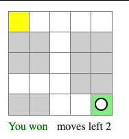

# Labyrinth technical challenge

> This challenge requires you to build a small application that works as a game using React.js.

<br />

## The rules of the final game are the following:
> * You (the black and white circle) start at a customizable initial position
> <br/> 
> * You can move using your keyboard's arrows (up/down/left/right)
> * Your objective is to move from the initial cell (yellow) to the target cell (green) before you run out of moves:
> <br/> 
> * When you win, you will get a "You won" message and won't be able to move any more
> * If you do run out of moves before you reach the target cell, then you lose:
> <br/> 
> * When you lose, you will get a "You lost" message and won't be able to move any more

<br />

## Technical requirements
* You can add any library you consider will help you build or test the game as long as they are "regular web application" libraries. That means you can use libraries that help you with styles, state management, testing, etc, but not libraries that are meant exclusively for building games.
* You have to pass the `unit tests` written in the `Labyrinth.test.tsx` file, but you can change those tests and the component's props if you consider that doing so might lead you to a better result.
* You have to test the application/components covering more functionality than the one covered by the provided tests.
* You have to build this application to the best of your abilities considering customization and the possibiility of extending it in the future.

<br />

## Nice to have
> Not doing these items **WON'T** be penalized and **you are not required to do any of them**, but if you do decide to do some of them, they might add to your *score* always considering code quality
* Styling (for example the circle/cells can be images or have movement/direction animations)
* Restart functionality
* Level progression (win and go the next level) 
* High scores
* Level builder
* War fog
* Anything you think might add value

<br />
<br />

# Labyrinth React App(Typescript)

This is the NEAR token explorer written by `smart-dev30`.
All the UI components and containers are written by [styled-components](https://styled-components.com/) and includes generic [eslint](https://eslint.org/) and [prettier](https://prettier.io/) configurations.

This project was bootstrapped with [Create React App](https://github.com/facebook/create-react-app).

## Setup
  > yarn install

## Screenshot


## Available Scripts

In the project directory, you can run:

### `yarn start`

Runs the app in the development mode.\
Open [http://localhost:3000](http://localhost:3000) to view it in the browser.

The page will reload if you make edits.\
You will also see any lint errors in the console.

### `yarn test`

Runs all the test cases in the development mode.\
You can see all the test case result.
### `yarn build`

Builds the app for production to the `build` folder.\
It correctly bundles React in production mode and optimizes the build for the best performance.

The build is minified and the filenames include the hashes.\
Your app is ready to be deployed!

See the section about [deployment](https://facebook.github.io/create-react-app/docs/deployment) for more information.

## Project structure

```
figment-explorer
├── components
│   ├── Cell           # Cell Component
│   ├── Button         # Button Component
│   ├── Modal          # Modal component
│   ├── Text           # Text
│   └── index.ts       # export all components in `components` folder level
│
├── levels             # Define all level variables
├── solutioin          # This will contain all web pages
│   ├── style.tsx      # main styled elements
│   └── index.tsx      # main web page
├── Labyrinth.tsx      # Define all test cases here
└── types              # Define types and interfaces
```
## Learn More

You can learn more in the [Create React App documentation](https://facebook.github.io/create-react-app/docs/getting-started).

To learn React, check out the [React documentation](https://reactjs.org/).
